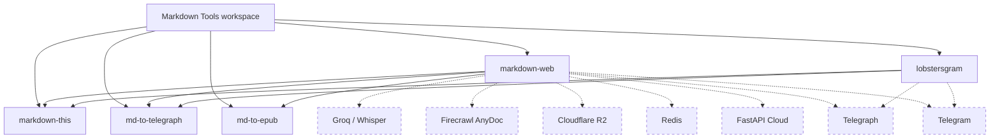

# Markdown Tools

Markdown Tools is a Python monorepo (uv workspace) with several packages for extracting web content as Markdown, converting Markdown into Telegraph pages, and connecting those tools to web and Telegram services.

[](https://github.com/mgaitan/markdown-tools/actions/workflows/ci.yml)

The repository started as Lobstersgram, but the reusable Markdown projects are
now first-class packages.

## Projects

- [`markdown-this`](https://github.com/mgaitan/markdown-tools/tree/master/packages/markdown-this): extracts web pages and
  supported special URLs as Markdown.
- [`md-to-telegraph`](https://github.com/mgaitan/markdown-tools/tree/master/packages/md-to-telegraph): converts Markdown
  into Telegraph DOM nodes and publishes Telegraph pages.
- [`md-to-epub`](https://github.com/mgaitan/markdown-tools/tree/master/packages/md-to-epub): builds EPUB 3 books from
  Markdown chapters with Sphinx and MyST.
- [`markdown-web`](https://github.com/mgaitan/markdown-tools/tree/master/packages/markdown-web): FastAPI service with web
  UI, URL endpoints, document upload, image upload, bookmarklets, and Telegraph
  publishing and Telegram notifications.
- [`lobstersgram`](https://github.com/mgaitan/markdown-tools/tree/master/src/lobstersgram): Telegram application that posts Lobsters
  links with clean Telegraph reading views.



## Documentation

Read the [central documentation](https://mgaitan.github.io/markdown-tools/).
Its source lives in [`docs/`](https://github.com/mgaitan/markdown-tools/tree/master/docs).
GitHub Pages rebuilds it when documentation changes reach `master`.
The Sphinx index includes this README
and then splits each project into overview, installation/usage, and technical
reference pages.

Build the docs locally with:

```bash
uv run --group docs sphinx-build -b html docs docs/_build/html
```

## Common Commands

```bash
uv sync
uv run pytest -q
uv run ruff check .
uv run ruff format --check .
uv build --all-packages
```

Run the web service locally with:

```bash
uv run --package markdown-web markdown-web
```

It exposes `/md/{url}` for Markdown, `/t/{url}` for Telegraph publishing, and
`POST /epub` for EPUB 3 downloads.
The public web app is available at <https://markdown.fastapicloud.dev/>.

Run the Lobstersgram app manually with:

```bash
uv run lobstersgram --help
```

## Releases

Packages are versioned and released independently. For example:

```bash
uv version --package markdown-this --bump patch
uv lock
git commit -am "Release markdown-this $(uv version --package markdown-this --short)"
tag="markdown-this-v$(uv version --package markdown-this --short)"
git tag "$tag"
git push origin "$tag"
gh release create "$tag" --verify-tag --generate-notes
```

Publishing a GitHub release triggers the package-specific workflow; pushing
a tag alone does not publish to PyPI:

- `publish-markdown-this.yml` publishes `markdown-this`.
- `publish-md-to-telegraph.yml` publishes `md-to-telegraph`.

`markdown-web` and `lobstersgram` are applications in this workspace and are
not published to PyPI.

## Package Boundaries

- Keep reusable extraction in `packages/markdown-this`.
- Keep Telegraph Markdown conversion and API publishing in
  `packages/md-to-telegraph`.
- Keep EPUB rendering in `packages/md-to-epub`.
- Keep web-service orchestration in `packages/markdown-web`.
- Keep Telegram/Lobsters scheduling, persistence, and channel behavior in
  `src/lobstersgram`.

The practical rule is boring: reusable packages should not import application
modules.
